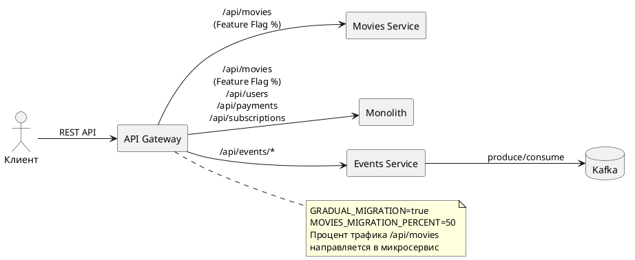

# C4 Container Diagram — CinemaAbyss To-Be Architecture

## Описание

Целевая архитектура системы «Кинобездна» с выделенными микросервисами, API Gateway (Strangler Fig), событийной архитектурой на Kafka и оркестрацией через Kubernetes.

## Диаграмма контейнеров (C4 Level 2)

Файл диаграммы: [c4-container-diagram.puml](c4-container-diagram.puml)

```plantuml
@startuml CinemaAbyss_C4_Container_Diagram
!include https://raw.githubusercontent.com/plantuml-stdlib/C4-PlantUML/master/C4_Container.puml

title CinemaAbyss To-Be — Container Diagram (C4 Level 2)

Person(user, "Пользователь", "Смотрит фильмы, оценивает, управляет подпиской")

System_Boundary(cinemaabyss, "CinemaAbyss Platform") {
    Container(proxy, "API Gateway / Proxy", "Go, Strangler Fig", "Единая точка входа. Маршрутизация трафика между монолитом и микросервисами с поддержкой Feature Flag")

    Container(monolith, "Monolith", "Go", "Управление пользователями, платежами, подписками. Постепенно уменьшается по мере выделения сервисов")

    Container(movies, "Movies Service", "Go", "Метаданные фильмов, рейтинги, жанры. Выделен из монолита")

    Container(events, "Events Service", "Go", "Обработка событий: просмотры фильмов, действия пользователей, платежи")

    ContainerDb(postgres, "PostgreSQL", "PostgreSQL 14", "Единая БД: пользователи, фильмы, платежи, подписки")

    ContainerQueue(kafka, "Apache Kafka", "Kafka 2.13", "Брокер сообщений: movie-events, user-events, payment-events")
}

System_Ext(recommendation, "Рекомендательная система", "Сторонний сервис подбора фильмов")

Rel(user, proxy, "HTTPS запросы", "REST API")
Rel(proxy, monolith, "HTTP", "/api/users, /api/payments, /api/subscriptions")
Rel(proxy, movies, "HTTP", "/api/movies (по Feature Flag)")
Rel(proxy, events, "HTTP", "/api/events/*")
Rel(monolith, postgres, "SQL", "TCP:5432")
Rel(movies, postgres, "SQL", "TCP:5432")
Rel(events, kafka, "Produce/Consume", "TCP:9092")
Rel(monolith, recommendation, "Async", "Рекомендации")

SHOW_LEGEND()
@enduml
```

## Домены системы

| Домен | Сервис | Описание |
|-------|--------|----------|
| Content | Movies Service | Метаданные фильмов, жанры, рейтинги |
| Users | Monolith (пока) | Регистрация, аутентификация, профили |
| Billing | Monolith (пока) | Платежи, подписки, скидки |
| Events | Events Service | Событийная шина через Kafka |
| Gateway | Proxy Service | Единая точка входа, Strangler Fig |

## Паттерн миграции Strangler Fig



## Взаимодействие компонентов

- **Синхронное**: REST API через API Gateway (proxy -> monolith/movies)
- **Асинхронное**: Events Service <-> Kafka (produce при вызове API, consume в фоне)
- **Strangler Fig**: постепенное переключение трафика `/api/movies` с монолита на микросервис через `MOVIES_MIGRATION_PERCENT`
